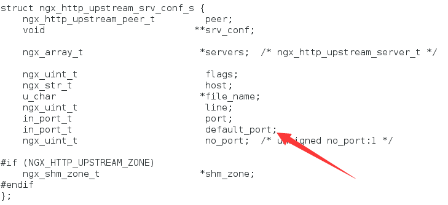

yum install -y pcre pcre-devel openssl openssl-devel libxml2 libxml2-devel libxslt libxslt-devel gd gd-devel perl-devel perl-ExtUtils-Embed libxslt libxslt-devel gd gd-devel zlib zlib-devel


安装geoip
安装libunwind
安装google-perftools
安装pcre

```
cat >> /etc/ld.conf <<EOF
/usr/local/pcre/lib
/usr/local/lib
EOF
ldconfig

wget http://geolite.maxmind.com/download/geoip/database/GeoLiteCountry/GeoIP.dat.gz
wget http://geolite.maxmind.com/download/geoip/database/GeoLiteCity.dat.gz

patch  -p1 </home/avgUser/nginx_upstream_check_module-master/check_1.9.2+.patch

./configure --prefix=/usr/local/nginx --user=nginx --group=nginx7 \
--without-select_module --with-file-aio --with-http_ssl_module  \
--with-http_realip_module  --with-http_addition_module \
--with-http_xslt_module --with-http_image_filter_module \
--with-http_geoip_module --with-http_sub_module \
--with-http_dav_module --with-http_flv_module \
--with-http_gzip_static_module \
--with-http_random_index_module --with-http_secure_link_module \
--with-http_degradation_module  --with-http_stub_status_module \
--with-http_perl_module --with-pcre=/root/pcre-8.39 \
--with-http_upstream_check_module --with-http_stub_status_module \
--add-module=/root/nginx-upstream-fair-master \
--add-module=/root/nginx_upstream_check_module-master \
--with-google_perftools_module  


vim /root/nginx-1.13.9/src/http/ngx_http_upstream.h
```

